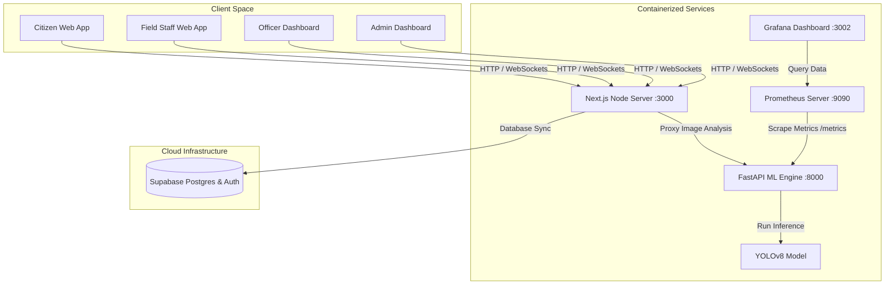

# CityPulse - DevOps & Systems Architecture Guide

This document outlines the containerization, orchestration, CI/CD pipeline, and monitoring systems designed for the production deployment of the **CityPulse** platform.

---

## 1. System Architecture

CityPulse is deployed as a multi-service architecture containing a Next.js Node client, a Python FastAPI machine learning engine, a Supabase PostgreSQL backend, and a Prometheus/Grafana monitoring agent.



---

## 2. Containerization (Docker & Docker Compose)

The application is containerized to isolate runtimes (Node.js for the frontend vs. Python/PyTorch for the ML backend) and ensure environment consistency across staging and production.

### Frontend Container (`Dockerfile`)
A **multi-stage Docker build** is used to reduce final image size and eliminate build-time development tools:
1. **Builder Stage:** Installs all `devDependencies`, copies source code, and runs `next build` to compile the TypeScript and Next.js packages.
2. **Runner Stage:** Inherits a clean, lightweight `node:18-alpine` base image, copies only the compiled output (`.next`), public assets, and production `node_modules`. Exposes port `3000`.

### Backend Container (`ml-service/Dockerfile`)
Built on `python:3.10-slim`, this container installs system libraries required for graphics rendering and OpenCV image processing (`libgl1` and `libglib2.0-0`), installs requirements (including PyTorch and Ultralytics), and starts the Uvicorn web server.

### Orchestration (`docker-compose.yml`)
The root `docker-compose.yml` launches three core services:
* `frontend`: Accessible on port `3000`.
* `ml-service`: Accessible on port `8000`, containing a volume mount mapping local directories to store temporary uploaded images for analysis.
* `prometheus`: Accessible on port `9090`.
* `grafana`: Accessible on port `3002`.

---

## 3. Monitoring & Telemetry (Prometheus & Grafana)

A production incident-management tool must monitor latency—specifically the duration of the YOLO model's computer vision inference when analyzing uploaded photos.

* **FastAPI Instrumentation:** The Python backend uses the `prometheus-fastapi-instrumentator` package to automatically record HTTP response durations, error rates, and CPU/memory utilization, exposing them at `http://localhost:8000/metrics`.
* **Prometheus Scraping:** Prometheus scrapes backend metrics every **5 seconds** (configured in `/prometheus/prometheus.yml`).
* **Grafana Visualization:** Grafana runs on port `3002` and queries Prometheus to graph real-time API latency and YOLOv8 inference response times.

---

## 4. Kubernetes Orchestration

For high-availability scaling, the project includes raw Kubernetes manifests located in the `/k8s` directory:

* **`frontend-deployment.yaml`:** Deploys **2 replicas** of the Next.js frontend behind a LoadBalancer service, managing rolling updates.
* **`backend-deployment.yaml`:** Deploys **2 replicas** of the ML backend behind a ClusterIP service. Because PyTorch models are CPU and memory-intensive, **resource limits** are explicitly configured to prevent memory leaks from starving other cluster services:
  ```yaml
  resources:
    limits:
      cpu: "1"
      memory: "2Gi"
    requests:
      cpu: "500m"
      memory: "1Gi"
  ```
* **`prometheus-deployment.yaml`:** Deploys the Prometheus monitoring server using a ConfigMap-based server configuration.

---

## 5. CI/CD Pipelines

Automated integration is configured using two different pipeline-as-code models:

### A. GitHub Actions (`.github/workflows/ci.yml`)
Runs on every code push or Pull Request to `main`. It checks code quality by:
1. Setting up Node.js and checking packages.
2. Setting up Python 3.10 and installing requirements.
3. Performing a test compile of the Docker containers using `docker compose build` to verify there are no compilation errors.

### B. Jenkins (`Jenkinsfile`)
A declarative pipeline configured for private build servers:
* Runs dependency installations in **parallel stages** (`Frontend Deps` and `Backend Deps`) to speed up pipeline execution time.
* Runs linting checks.
* Builds Docker images for both frontend and backend.
* Pushes the images to a container registry (e.g., Docker Hub) upon successful verification of the `main` branch.

---

## 6. How to Run & Verify

To spin up the entire local containerized infrastructure:

1. **Verify Environment Variables:** Make sure you have a `.env` file in the root containing your Supabase keys:
   ```env
   NEXT_PUBLIC_SUPABASE_URL=your_supabase_url
   NEXT_PUBLIC_SUPABASE_ANON_KEY=your_supabase_anon_key
   ```
2. **Build and Start Compose:**
   ```bash
   docker compose up --build
   ```
3. **Verify running targets:**
   * Open Prometheus at `http://localhost:9090` $\rightarrow$ **Status** $\rightarrow$ **Targets** to verify the `ml-service` is online and scraping.
   * Open Grafana at `http://localhost:3002` to build dashboards.
